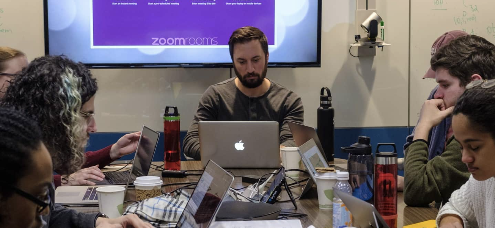

# Jethro Gaglione - Portfolio

# Descriptions and Links to Relevant Projects

## 1. Migration of data analysis framework for CERN CMS's Beyond Standard Model - 3rd Generation experimental group
**Framework description:** The BSM-3G Analyzer is the main data analysis framework used by the Beyond Standard Model - 3rd Generation group at CERN's Compact Muon Solenoid (CMS) experiment. This group focuses on newly theorized particle and dark matter searches and is responsible for over 20 publications in top peer-reviewed physics journals. This analysis framework has multi-tiered functionality -- mining from a database where 100,000 particle collisions are registered per second, cleaning and filtering good events according to collaboration standards, and analyzing/plotting said data. 
The framework is primarily written in C++, with heavy use of the [ROOT](https://root.cern/) library.
**My role:** Every so often, the CMS collaboration updates their data structures to refelct latest hardware-level calibrations, implement more efficient storage, or generate collections for special use cases. My job was to migrate our analysis framework to handle the "Ultralegacy" tree-structure update, which was a collaboration-wide requirement for any future, publishable analysis. My work on this project in a nutshell:

- Adapting functionality to handle new raw data format
- Updating data filters and corrections/weights
- Implementing updated ML-based algorithms for particle reconstruction and identification 
- Functional testing of updated framework

**Link to framework:** [BSM-3G Ultralegacy Analyzer](https://github.com/BSM3G/NanoAOD_Analyzer_UL) (note: most relevant code in `\src` dir.)

## 2. Update to parallelization, cluster submission, and data intergration framework
**Program description:** Due to the large quantity of particle collision information to be stored, the data is seperated into many ROOT-formatted files each containing ~10 million events. The data analyzer framework described above runs on one file at a time and produces a ROOT file as output. This workflow requires running hundreds of files for a given collection of relevant data. We automate the parallelization, submission to a computing cluster, and integration of outputed data via a Python program and the open-source [HTCondor](https://htcondor.org/) software suite. The migration to the Ultralegacy data format required a corresponding update to this parallelization/submission/intergration framework. My work on this project in a nutshell:

- Updating back end functionality for updated config. file format and user end usage
- Evaluating/Adjusting grid requirements for job submission
- Enhancing error handling and resubmission upon run failures

** Links:** [submission framework](https://github.com/BSM3G/NanoAOD_Submission), [ROOT file combining program](https://github.com/BSM3G/NanoAOD_Analyzer_UL/blob/master/add_root_files_2016.py)

## 3. Machine learning course-related projects
CERN offers graduate training and courses in subjects widely used in experimental physics technology, such as machine learning and computational physics. I completed a ML course offered via CERN, taught by Prof. Sergei Gleyzer of the University of Alabama (UA). Though the projects associated with the course were partly instructor-developed (not subject to being publicly posted), here are the main focus points of the course:
- Fundamentals of machine learning and classification theory
- Theory and application of standard supervised and unsupervised ML algorithms
- Mathematical and statistical methods and performance metrics.
- Use of common ML packages, particularly Scikit-lear, TensorFlow, and Keras.

## 4. Computational physics course-related projects
I also completed a computation physics course via CERN, taught by prof. Salvatore Rapoccio at the State University of New York at Buffalo. Similary, the main focus of this course was:

- Numerical analysis and computer programming in C++ and python (and their combination)
- Technicalities of scientific programming (including git, containers like docker, pip, etc)
- Review of umerical algorithms for root finding, interpolation, matrix inversion, numerical differentiation, and quadrature, data analysis, Fourier transformations, linear and nonlinear differential equations, boundary-value and eigenvalue problems.

